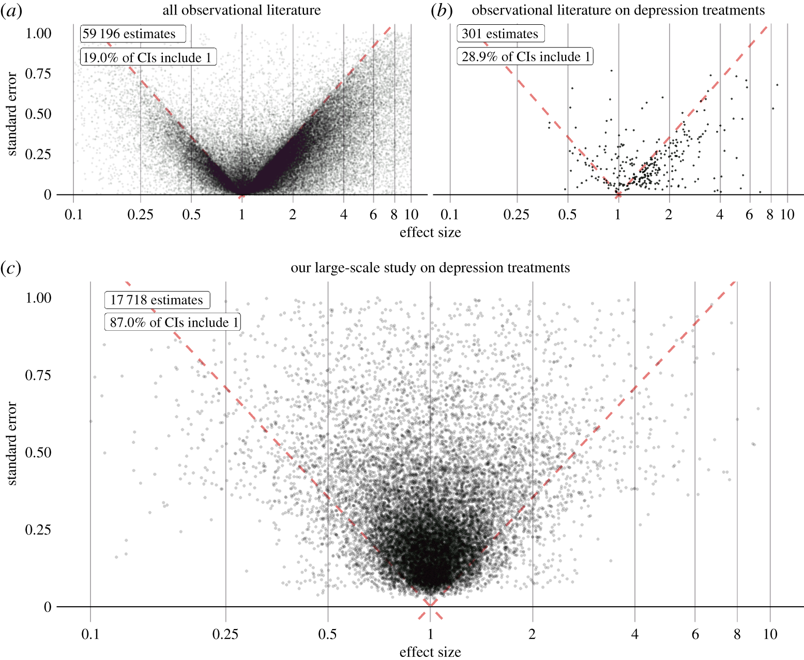

```{r setup, include=FALSE}
# No scaffold() here; this slide deck is intended to show the core ideas directly.
```

## Agenda

- Put `CohortMethod` in perspective: know the design logic, not every default
- Briefly situate other estimation options, especially `SelfControlledCaseSeries`
- Make diagnostics and failure rules explicit before reviewing estimates
- Use `renv` to lock and restore package versions
- Review how Strategus results move from folders to databases and reports

## What You Are Actually Expected to Know

- You are not expected to memorize every default in `CohortMethod` or `CohortMethodModule`
- You are expected to understand the design choices: target, comparator, outcome, washout, risk window, PS strategy, outcome model, and diagnostics
- Inspect defaults with the documentation and `formals()` before you accept them
- In real projects, design choices are usually reviewed with both a clinician and a statistician

## Other Population-Level Estimation Packages

- `SelfControlledCaseSeries` (SCCS) is a within-person, case-only design
- Each person serves as their own control, so time-invariant confounding is reduced by design
- SCCS is attractive when exposure timing and outcome timing are the key question
- SCCS is not a drop-in replacement for `CohortMethod`; it comes with its own assumptions and diagnostics
- In Strategus, this appears through `SelfControlledCaseSeriesModule`

## Diagnostics Need To Be Prespecified

- Do not wait until after the estimates to decide what counts as "good enough"
- Prespecify diagnostics and what failure means before reviewing results
- Typical examples: balance, overlap/equipoise, attrition, MDRR, and EASE
- If diagnostics fail, the right conclusion is often "not interpretable yet," not "no effect"

## Why We Must Publish All Results

{fig-alt="Volcano plots comparing the published observational literature with a large-scale systematic study." height="550"}

Selective publication can make an evidence base look much stronger and much more directional than it really is.

## Why We Need `renv`

- Without version control for packages, the same code can work on one machine and fail on another
- `renv` creates a project-specific library instead of relying on whatever happens to be installed globally
- `renv.lock` records exact package versions so collaborators can recreate the environment
- Strategus helps reproducibility at the study-design level; `renv` helps reproducibility at the software-environment level

## The Minimum `renv` Workflow

```r
renv::init()

# install or update packages as needed

renv::snapshot()
renv::restore()
```

- `snapshot()` writes the current package state to the lockfile
- `restore()` rebuilds the project library from that lockfile
- Important: `renv::install()` alone is often not enough to put a package into `renv.lock`

## How `renv` Decides What To Lock

- By default, `renv::snapshot()` uses implicit discovery of project dependencies
- That means `install()` changes the project library, while `snapshot()` decides what gets declared in the lockfile
- It scans the whole project recursively, not just the file you happen to run today
- It looks for patterns like `library(pkg)`, `require(pkg)`, and `pkg::fun()`
- Use `renv::dependencies()` to inspect what `renv` thinks the project uses
- Use a small project or `.renvignore` when you want tighter control over the scan

## Demo Pattern We Will Use

```r
renv::init()
renv::install("dplyr")
dplyr::tibble(x = 1:3)
renv::snapshot()
renv::restore()
```

- We keep the demo in a tiny project and put the workflow in `RenvManagement.R`
- That gives one obvious file to run, while still letting `renv` scan the whole project
- **Note:** Installed does not automatically mean locked

## Same Idea For GitHub Packages

```r
renv::install("OHDSI/Strategus")
renv::install("OHDSI/CohortGenerator")
Strategus::createResultsDataModelSettings(
  resultsDatabaseSchema = "study_results",
  resultsFolder = "demo-results"
)
renv::snapshot()
```

- `renv.lock` records the GitHub remote metadata as well as the package version
- `renv::install("OHDSI/Strategus")` alone may not lock it; you still need project code that references it before an implicit `snapshot()`
- This matters because many OHDSI workflows depend on packages installed from GitHub

## Reporting After Strategus Runs

- Every module writes result files to the `resultsFolder` in your execution settings
- For quick checks, you can inspect CSV outputs directly
- For integrated review across modules, load results into a database
- From there you can use the OHDSI Shiny results viewer or `OhdsiReportGenerator`

## Reporting Note For Today

- We are not going to cover how to run the OHDSI Shiny apps locally on your machines
- In practice this can be temperamental because of environment, database, and package issues
- Today the goal is to understand the reporting workflow and browse existing examples

## Public Results Apps To Browse

- Main site: <https://results.ohdsi.org/>
- Estimation example: <http://results.ohdsi.org/app/21_Semanaion_Est>
- Characterization example: <https://results.ohdsi.org/app/20_Semanaion_Char>
- We can use these live to browse the kinds of outputs the reporting stack exposes

## Results Database Workflow

```r
resultsDataModelSettings <- Strategus::createResultsDataModelSettings(
  resultsDatabaseSchema = "study_results",
  resultsFolder = "path/to/results"
)

Strategus::createResultDataModel(
  analysisSpecifications = analysisSpecifications,
  resultsDataModelSettings = resultsDataModelSettings,
  resultsConnectionDetails = resultsConnectionDetails
)

Strategus::uploadResults(
  analysisSpecifications = analysisSpecifications,
  resultsDataModelSettings = resultsDataModelSettings,
  resultsConnectionDetails = resultsConnectionDetails
)
```

- The schema should already exist, and it should be empty before creation

## Reality Check: Manual Extraction Still Happens

- Historically, we have often had to manually extract results from the results schema
- That workflow is not ideal: the schema is confusing, extraction is error-prone, and it is easy to make inconsistent choices
- It also goes somewhat against the OHDSI norm of using shared tooling and standard result viewers
- But in practice it is sometimes still required while the software and reporting workflows continue to mature

## OHDSI Norms And Debates

- Oversimplifying a bit, there are different instincts within the OHDSI community
- One instinct is to keep everything "on rails"
- Standard data model, standard packages, standard diagnostics, standard reporting
- Main benefit: comparability and fewer analyst degrees of freedom

## A Different Instinct

- Another instinct is to treat OMOP as a great schema and HADES as a strong toolbox
- That view is more comfortable doing bespoke analyses with other tools
- Main benefit: flexibility and tailoring the method to the question
- If you go off rails, the burden on documentation, diagnostics, and justification goes up

## Final Takeaways

- Learn the logic of the design; do not try to memorize every default
- Use `renv` so your software environment is reproducible too
- Plan the results-review pipeline before running the study
- Treat diagnostics as hard and fast decision rules, not optional
- Publish and report all results, especially when they are inconvenient
